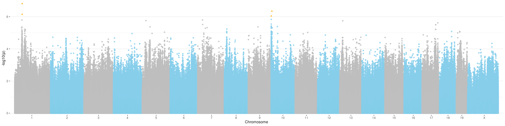
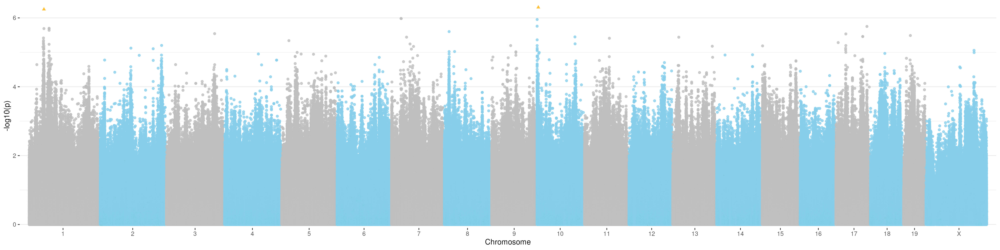
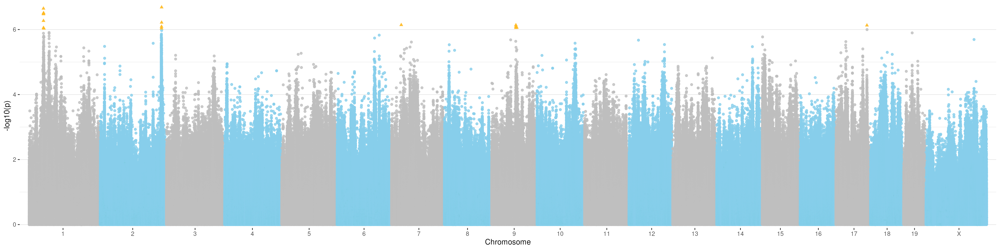
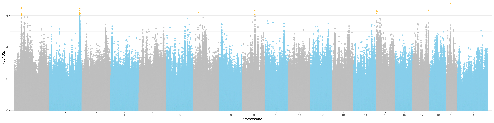

# Behavioral hologenomics GWAS analysis
This is the pipeline for running a genome-wide association analysis between the behavioral dominance indices (measured through tube-tests) and genotypes of JAX Diversity Outbred mice. The pipeline is written to run analyses in the Mjolnir HPC of the Globe Institute (University of Copenhagen). The code below creates slurm executable shell files (e.g., '0_subset.sh') that are sent for computation to the job queeue using 'sbatch'. 

## Fetch VCF file from ERDA

The variant calling VCF file generated through the [hg_genotype](https://github.com/3d-omics/hg_genotype) pipeline is stored in ERDA. This big file (around 25GB of compressed document) needs to be downloaded to the software to begin the analysis.

```sh
wget https://sid.erda.dk/share_redirect/F0LbFHgFdk/variants_filtered.vcf.gz
```

## Subset and rename VCF

The VCF file contains data from 3 animals from cages that are not included in this analysis, which need to be removed from the database. The resulting dataset contains genotype information of 40 mice belonging to 8 cages (5 animals per cage). In addition, the mouse identifiers used in the genomic analysis are not identical to the standard one, so these are also renamed for the sake of consistency.

```sh
#Create the batch file
cat <<EOF > 0_subset.sh
#!/bin/bash
#SBATCH --job-name=0_subset
#SBATCH --nodes=1
#SBATCH --ntasks=1
#SBATCH --mem=128gb
#SBATCH --time=0:15:00

# Load required modules in the server
module load perl gsl/2.5 bcftools/1.16

# Filter samples
bcftools view -s ^treatment_male_01_1,treatment_male_07_3,treatment_male_08_1 variants_filtered.vcf.gz > variants_filtered2.vcf

# Rename mouse identifiers
bcftools reheader -s rename.txt variants_filtered2.vcf > variants_filtered3.vcf
EOF

#Launch the batch file
sbatch 0_subset.sh
```

## Create plink bed files from VCF

The GWAS analysis tool we will employ require genotype information to be in bed format. This can be achieved using plink2. Plink also enables us to include sex information and to assign unique codes to all variants, which is necessary for downstream analyses.

```sh
#Create the batch file
cat <<EOF > 1_input.sh
#!/bin/bash
#SBATCH --job-name=1_input
#SBATCH --nodes=1
#SBATCH --ntasks=1
#SBATCH --mem=128gb
#SBATCH --time=1:00:00

# Load required modules in the server
module load openblas/0.3.24 plink/2.0.0

# Run format conversion
plink2 --vcf variants_filtered3.vcf --pheno beho_phenotype.tsv --update-sex beho_sex.tsv --max-alleles 2 --set-all-var-ids @_# --make-bed --out variants_filtered

# Run format conversion and extract only desired chromosomes (used only for initial tests of the pipeline)
# plink2 --vcf variants_filtered3.vcf --pheno beho_phenotype.tsv --update-sex beho_sex.tsv --max-alleles 2 --chr 1-2 --set-all-var-ids @_#  --make-bed --out variants_filtered_chr1-2
EOF

#Launch the batch file
sbatch 1_input.sh
```

## Run GWAS with GridLMM

[GridLMM](https://github.com/deruncie/GridLMM) is a package for fitting linear mixed models (LMMs) with multiple random effects, which is useful for GWAS analyses because it contains a fitting process optimised for repeated evaluation of the random effect model with different sets of fixed effects. As we have (slightly) different dominance values for the different time points, we run 7 different GWAS analyses associating dominance indices in each time point with the mouse genotypes. This approach provides an overview of the signal variation through time. We also include a GWAS analysis with the mean dominance value of each mouse. The R code required for this analysis can be found in 'code/gwas.R'. Output data is stored as a Rdata file in the 'results' directory.

```sh
#Create the batch file
cat <<EOF > 2_gwas.sh
#!/bin/bash
#SBATCH --job-name=2_gwas
#SBATCH --nodes=1
#SBATCH --ntasks=8
#SBATCH --mem=500gb
#SBATCH --time=24:00:00

# Load R (with all dependencies already installed)
module load gcc R/4.2.1

# Run R scripts for mean dominance and time-specific dominance metrics
Rscript code/gwas.R -i "variants_filtered" -m "data/dominance_mean.tsv" -o "results/gwas_dominance_mean.Rdata"
Rscript code/gwas.R -i "variants_filtered" -m "data/dominance_op.tsv" -o "results/gwas_dominance_op.Rdata"
Rscript code/gwas.R -i "variants_filtered" -m "data/dominance_ht.tsv" -o "results/gwas_dominance_ht.Rdata"
Rscript code/gwas.R -i "variants_filtered" -m "data/dominance_hr.tsv" -o "results/gwas_dominance_hr.Rdata"
Rscript code/gwas.R -i "variants_filtered" -m "data/dominance_cd.tsv" -o "results/gwas_dominance_cd.Rdata"
Rscript code/gwas.R -i "variants_filtered" -m "data/dominance_cr.tsv" -o "results/gwas_dominance_cr.Rdata"
Rscript code/gwas.R -i "variants_filtered" -m "data/dominance_dt.tsv" -o "results/gwas_dominance_dt.Rdata"
EOF

#Launch the batch file
sbatch 2_gwas.sh
```

## Generate Manhattan plot

A Manhattan plot is a type of scatter plot commonly employed to visualise the physical location of SNPs with extreme p-values, indicating a probable association with the tested variable. In GWAS Manhattan plots, genomic coordinates are displayed along the x-axis, with the negative logarithm of the association p-value for each single nucleotide polymorphism (SNP) displayed on the y-axis. The R code required for this analysis can be found in 'code/manhattan.R'. Outputs are Manhattan plots in png format stored in the 'figures' directory.

```sh
#Create the batch file
cat <<EOF > 3_manhattan.sh
#!/bin/bash
#SBATCH --job-name=3_manhattan
#SBATCH --nodes=1
#SBATCH --ntasks=1
#SBATCH --mem=48gb
#SBATCH --time=6:00:00

# Load R (with all dependencies already installed)
module load gcc R/4.2.1

# Run R scripts for mean dominance and time-specific dominance metrics
Rscript code/manhattan.R -i "results/gwas_dominance_mean.Rdata" -o "figures/gwas_dominance_mean.png"
Rscript code/manhattan.R -i "results/gwas_dominance_op.Rdata" -o "figures/gwas_dominance_op.png"
Rscript code/manhattan.R -i "results/gwas_dominance_ht.Rdata" -o "figures/gwas_dominance_ht.png"
Rscript code/manhattan.R -i "results/gwas_dominance_hr.Rdata" -o "figures/gwas_dominance_hr.png"
Rscript code/manhattan.R -i "results/gwas_dominance_cd.Rdata" -o "figures/gwas_dominance_cd.png"
Rscript code/manhattan.R -i "results/gwas_dominance_cr.Rdata" -o "figures/gwas_dominance_cr.png"
Rscript code/manhattan.R -i "results/gwas_dominance_dt.Rdata" -o "figures/gwas_dominance_dt.png"
EOF

#Launch the batch file
sbatch 3_manhattan.sh
```












## Extract information of relevant SNPs

SNPs with p-values under 10e-6 are outputes into tables for downstream analyses. The R code required for this analysis can be found in 'code/candidates.R'. Outputs are tabular tables in tsv format stored in the 'results' directory.

```sh
#Create the batch file
cat <<EOF > 4_candidates.sh
#!/bin/bash
#SBATCH --job-name=4_candidates
#SBATCH --nodes=1
#SBATCH --ntasks=1
#SBATCH --mem=48gb
#SBATCH --time=1:00:00

# Load R (with all dependencies already installed)
module load gcc R/4.2.1

# Run R scripts
Rscript code/candidates.R -i "results/gwas_dominance_mean.Rdata" -o "results/gwas_dominance_mean.tsv"
Rscript code/candidates.R -i "results/gwas_dominance_op.Rdata" -o "results/gwas_dominance_op.tsv"
Rscript code/candidates.R -i "results/gwas_dominance_ht.Rdata" -o "results/gwas_dominance_ht.tsv"
Rscript code/candidates.R -i "results/gwas_dominance_hr.Rdata" -o "results/gwas_dominance_hr.tsv"
Rscript code/candidates.R -i "results/gwas_dominance_cd.Rdata" -o "results/gwas_dominance_cd.tsv"
Rscript code/candidates.R -i "results/gwas_dominance_cr.Rdata" -o "results/gwas_dominance_cr.tsv"
Rscript code/candidates.R -i "results/gwas_dominance_dt.Rdata" -o "results/gwas_dominance_dt.tsv"
EOF

#Launch the batch file
sbatch 4_candidates.sh
```

## Variant exploration (to be completed)

```sh
#plink2 --bfile variants_filtered --snp 9_69129524 --out 9_69129524 --export ped
```
